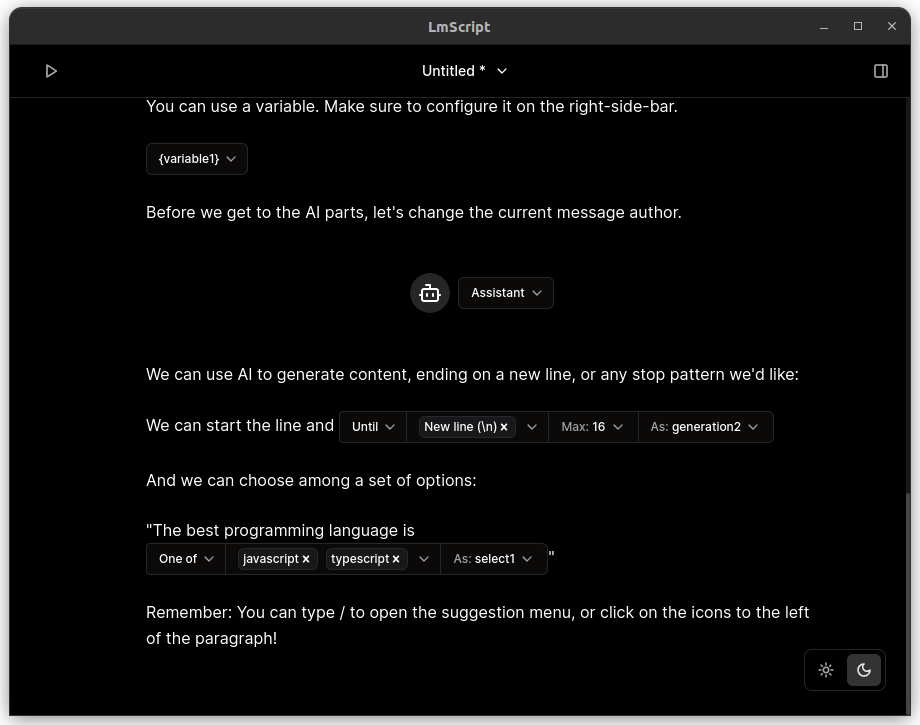

# LmScript

LmScript: Fast and Controllable Language Model Interactions in Typescript

- LMScript: a suite of tools for easy, fast, and controllable interactions with
  language models in Typescript.
- Open models and open source.
- Powered by SGLang.

## What the code looks like?

```ts
const { captured: { language } } = await client
  .push("The best programming language is ")
  .select("language", { choices: ["javascript", "typescript"] })
  .run();

console.log(language);
```

There are more complete examples in the
[client's examples folder](https://github.com/lucasavila00/LmScript/tree/main/client/examples).

## Do you prefer a graphical interface?



## Projects

| Project                                                                                                 | Description                                                                                 |
| ------------------------------------------------------------------------------------------------------- | ------------------------------------------------------------------------------------------- |
| [Typescript Client](https://github.com/lucasavila00/LmScript/tree/main/client)                          | Dependency-free client that can communicate with different backends.                        |
| [GUI](https://github.com/lucasavila00/LmScript/tree/main/egui)                                          | Desktop Application that creates and executes LmScript programs.                            |
| [Runpod Serverless SGLang](https://github.com/lucasavila00/LmScript/tree/main/runpod-serverless-sglang) | Docker image that runs SGLang on [Runpod Serverless](https://www.runpod.io/serverless-gpu). |
| [Runpod Serverless vLLM](https://github.com/lucasavila00/LmScript/tree/main/runpod-serverless-vllm)     | Docker image that runs SGLang on [Runpod Serverless](https://www.runpod.io/serverless-gpu). |
